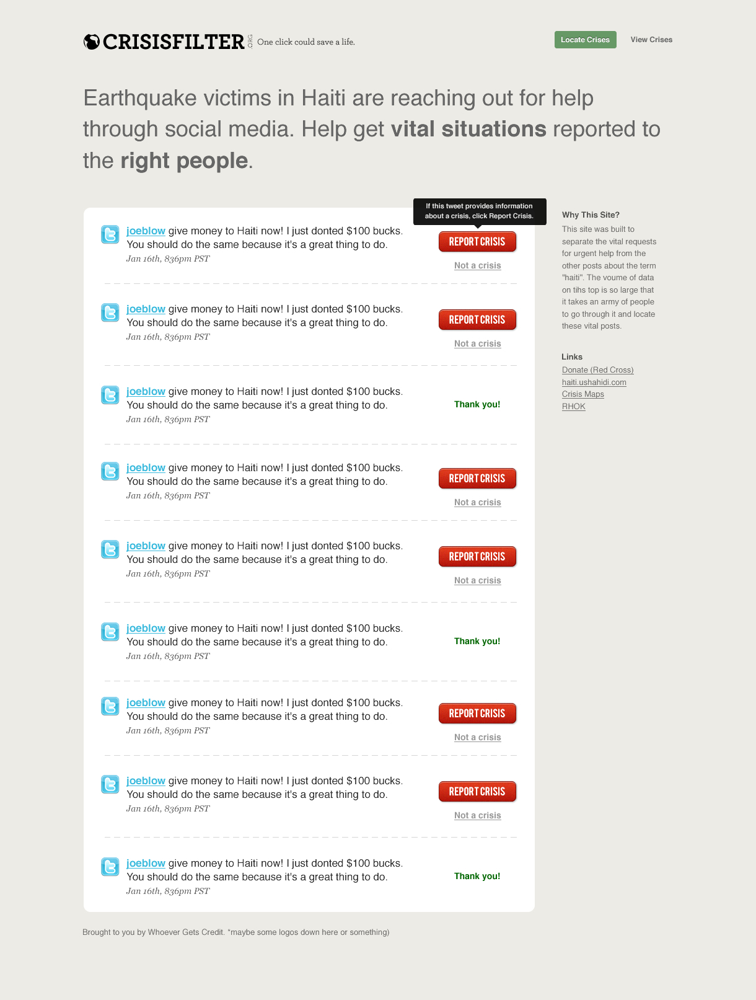

# HaitiStream

## Crowd-sourced Twitter stream filtering

* Pulls tweets tagged with #haiti from Twitter.
* Presents them to anyone who visits.
* Visitors identify tweets from/about people in actionable crisis situations.
* Aid organizations can view the highest-voted (i.e. most critical) tweets from a given time slice.

## How the front end should look

See doc/crisisfilter2.jpg.

## TODO (in no particular order)

* make the front page look nicer
* make the filter page look nicer
* make the filter page more useful/usable
* make sure we catch all tweets
* make sure interaction is speedy
  * we store tweets indefinitely, which will eventually slow us down
  * we fetch tweets from Twitter in a user thread
  * other problems, no doubt
